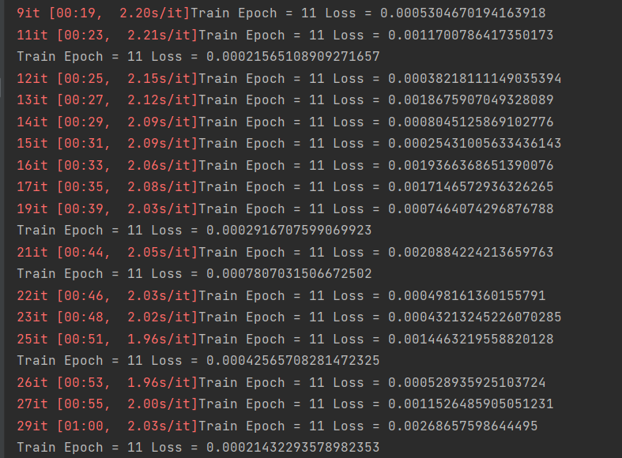
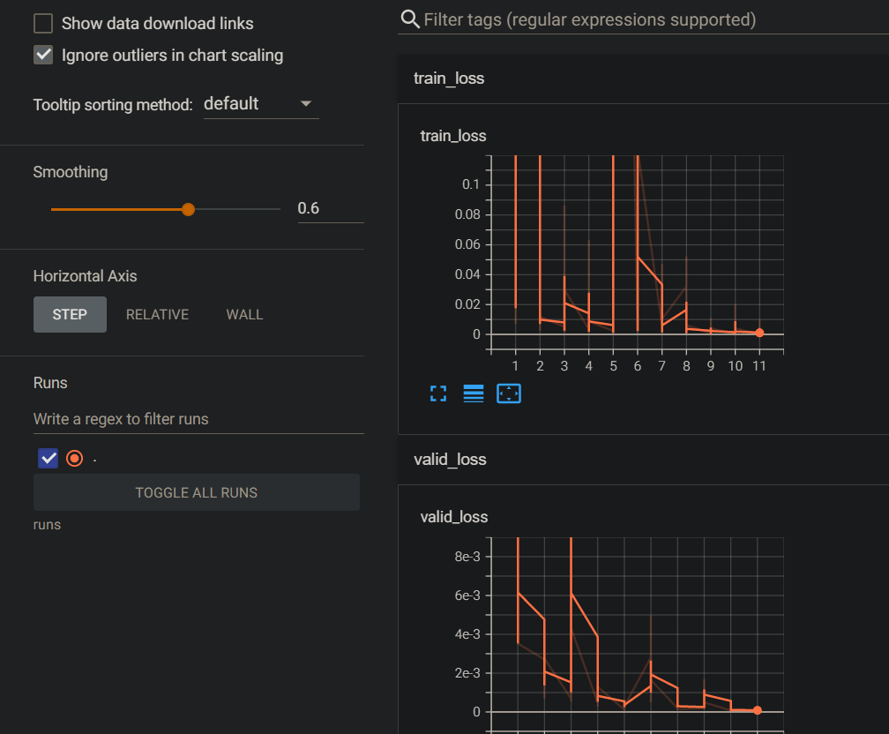
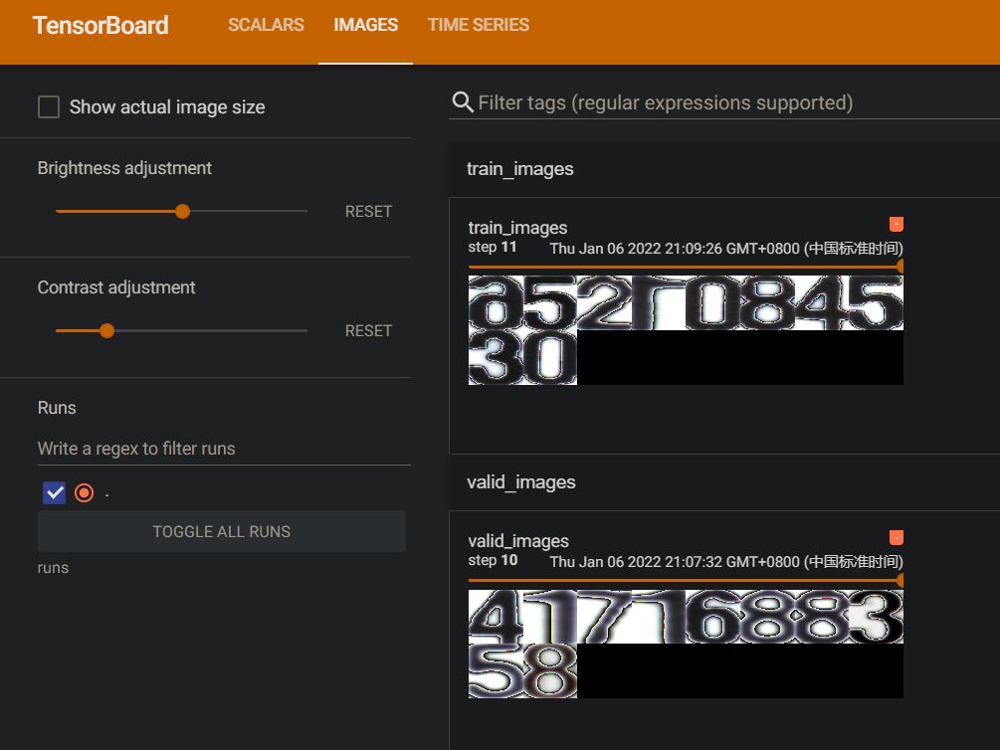
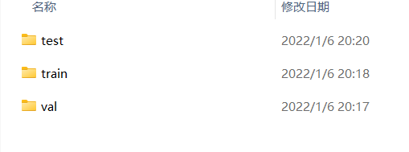
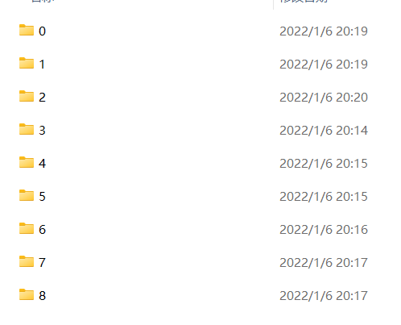
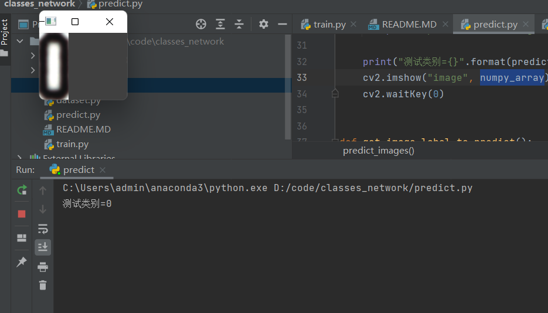

## Pytorch Resnet18 自定义图像数据集分类

## 训练
- 1 数据集准备:将数据集按照文件夹分类(类别使用数字)
- 2 修改配置文件config.py 配置好分类总数, 数据集路径等
- 3 开启训练 python train.py

## 预测
- 1 修改配置文件config.py 指定要加载的模型,测试集路径等
- 2 开启预测 python predict.py

## tensorboard 查看
- 1 tensorboard --logdir=runs

## 运行截图

